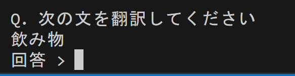
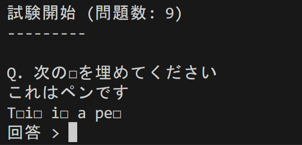
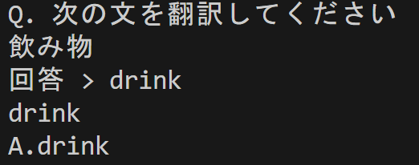

## 簡単英語学習CLIツール

### 背景

私はチャロや短編英ドラマ等で英語の学習をしていました  
学習メモは以下の形式でメモり、復習をする際は英語部分を隠して、日本語を翻訳していました

```txt
Please don't say that
そんなこといわないで

little doggie
小さな犬
```

いちいち英語を隠して、実施すること自体が **面倒くさい** と思ったこと、
**出題パターンが日本語からの翻訳のみではワンパターンで答えの暗記** となり、
**復習の精度が低い** と思い自己学習用に開発へ取り組みました

### 非エンジニア向け

#### ツールの使用方法

本ツールは日本語と英語のデータセット(txt)を読みこみ、
2種類の出題パターンより問題を出します。

以下形式のテキストを ~/document/java/EnglishManager/ へ格納する

```txt
English
英語
```

問題は以下のように出題され、回答後答えも出力される

| 翻訳形式の問題 | 虫食い問題 | 翻訳軽視の問題(答え) |
|---------|-------|-------|
|  |  ||

### エンジニア向け

#### 開発環境

- エディタ
  - vscode
- java version
  - 21.0.2

#### クラス概要

- App.java
  - マネージャとユーザの操作
  - 英語アプリの流れを担っている
- Manager.java
  - ユーザーに名前を尋ねる
  - ユーザー情報を登録
  - ユーザー名を記憶すること
  - ユーザーへ挨拶をすること
  - 問題を用意してあることを確認すること
  - 問題群を取得すること
  - 問題の準備をすること
  - 問題の答えを取得すること
  - 問題を実施すること
- ManagerInterface.java
  - マネージャクラスのインターフェース
- ManagerLogic.java
  - 虫食い問題の作成ロジック
  - 翻訳問題の作成ロジック
- User.java
  - 出題してほしい問題番号を伝えること
  - 問題に答えること

#### クラス図

TBD

#### 苦労したところ

- 問題点
  - Scannerクラスのインスタンスは一度 close すると再利用不可
- 解決策
  - Scannerインスタンスは使いまわす

◆ App.java

```java
Scanner sc = new Scanner(System.in); //"Shift-JIS"
User.choseNumberForQuestion(sc);
User.answerQuiz(sc);
```

◆ User.java

```java
  public int choseNumberForQuestion(Scanner sc){
        if(sc.hasNextInt()){
            int QuestionNumber = sc.nextInt();sc.nextLine();
            return QuestionNumber;
        }//..省略
    }
    public String answerQuiz(Scanner sc){
        System.out.print("回答 > ");
            if(sc.hasNextLine()){
                String questionAnswer = sc.nextLine();
                return questionAnswer;
            }//..省略
    }
```

- 問題点
  - インターフェースをimplementする際は引数も合わせなければいけない
- 解決策
  - interfaceの引数をClassと合わせる

◆ ManagerInterface.java

```java
public interface ManagerInterface(){
    void askForUserName(Scanner sc);//ユーザーに名前を尋ねる    
    void registUserInfo(String name);//ユーザー情報を登録
}
```

◆ Manager.java

```java
public class Manager implements ManagerInterface(){
    public void askForUserName(Scanner sc){
        //省略
    }
    public void registUserInfo(String name){
        //省略
    }    
}
```

- 問題点
  - Stringに特定位置の文字列置き換えメソッドがない
- 解決策
  - `java.lang.StringBuilder` を利用する

```java
StringBuilder replaceWord = new StringBuilder();
String word = "abcd";
replaceWord.append(word);
replacLeafWarblerWord.replace(0,1,"A");
// before:word=abcd , after:word=Abcd
```

- 問題点
  - ArrayListの値格納と取得は配列の要素指定ではなくメソッドを利用する
- 解決策
  - ArrayListの値を格納・取得の際はメソッドを利用する

```java
new List<String> arrays = new ArrayList<String>(); //宣言
answer.add("ABC"); //値の格納
answer.get(0); //値の取得
```

#### ソースコード

- App.java

```java
import java.io.File;
import java.util.List;
import java.util.Scanner;
public class App {
    public static void main(String[] args) throws Exception {
        Manager mn = new Manager();
        User us = new User();
        String checkedUserInfoAnswer = mn.checkUserInfo();
        Scanner sc = new Scanner(System.in, "Shift-JIS");
        if(checkedUserInfoAnswer.equals("NotFound")){//User未登録
            mn.askForUserName(sc);
        }else{
            mn.setUserName(checkedUserInfoAnswer);
            mn.helloUser();
        }
        mn.checkDataSetDir();
        
        File[] files = mn.getDataSetFiles();
        if(files.length > 0){
            mn.presentsQuetionsFile(files); // Manager : 問題のデータセットを提示する
            int questionNumber = us.choseNumberForQuestion(sc); // User : 問題のデータセットより対象を選ぶ
            String questionReady = mn.questionReady(questionNumber,files);
            if(questionReady.equals("OK")){
                ManagerLogic lg = mn.useManagerLogic();
                List<String> questions = mn.createQuestion(lg);
                List<String> answers = mn.getAnswer(lg);
                mn.quizExits(questions,answers,us,sc);// Manager : 問題を出題する User : 一問一答で回答する。
                
                //mn.setLog();// 回答ログを記録する
            }
            
        }else{
            System.out.println("datasetフォルダに問題ファイルを1つ以上格納してください");
        }
        sc.close();
    }
}

```

- ManagerInterface.java

```java
import java.io.File;
import java.util.List;
import java.util.Scanner;

public interface ManagerInterface {
    void askForUserName(Scanner sc);//ユーザーに名前を尋ねる    
    void registUserInfo(String name);//ユーザー情報を登録
    void setUserName(String content);//ユーザー名をフィールドにセットする
    void helloUser();//ユーザーに挨拶
    String checkDataSetDir();//問題データが存在することを確認
    File[] getDataSetFiles();//問題データセット群を取得する
    void presentsQuetionsFile(File[] files);//問題データセット群を表示する
    String questionReady(int questionNumber,File[] files);//問題(試験)の準備をする
    ManagerLogic useManagerLogic();//Logicを利用する
    List<String> createQuestion(ManagerLogic lg);//問題(試験)を作成する
    List<String> getAnswer(ManagerLogic lg);//問題(試験)の答えを取得する
    void quizExits(List<String> questions,List<String> answers,User us,Scanner sc);//問題(試験)を実施する
}

```

- Manager.java

```java
import java.io.BufferedWriter;
import java.io.File;
import java.io.FileWriter;
import java.io.IOException;
import java.nio.file.Files;
import java.nio.file.Path;
import java.nio.file.Paths;
import java.util.List;
import java.util.Scanner;
import java.util.regex.Matcher;
import java.util.regex.Pattern;
public class Manager implements ManagerInterface{
    private String userInfoFilePath = "./userinfo.txt";
    private String dataSetFilePath = "./dataset/";
    public String userName;
    public int numberOfQuestion = 0;
    private String questionDatas;
    public Manager(){
    }
    public String checkUserInfo(){
        Path path = Paths.get(userInfoFilePath);
        try{
            String content = Files.readString(path);
            return content;
        }catch(IOException e){
            return "NotFound";
        }
    }
    public void askForUserName(Scanner sc){
        System.out.println("あなたの名前を教えてください");
        System.out.print("名前 > ");
        if(sc.hasNext()){
            String userName = sc.next();
            registUserInfo(userName);
            System.out.println(userName + "さん これからよろしくお願いします。");
            this.userName = userName;
        } 
    }
    public void registUserInfo(String name){
        try{
            File f = new File(this.userInfoFilePath);
            BufferedWriter bw = new BufferedWriter(new FileWriter(f));
            bw.write("name:" + name);
            bw.close();
        }catch(IOException e){
            System.out.println("RegistUserInfoError\n" + e.getMessage());
        }
    }
    public void setUserName(String content){
        Pattern p = Pattern.compile("name:(.*)");
        Matcher match = p.matcher(content);
        if(match.matches()){
            this.userName = match.group(1);
        }
    }
    public void helloUser(){
        System.out.println(this.userName + "さん よろしくお願いします。");
    } 
    public String checkDataSetDir(){
        Path path = Paths.get(dataSetFilePath);
        if(Files.exists(path)){
            return "OK";
        }else{
            try{
                Files.createDirectory(path);
            }catch(IOException e){
                System.out.println("DataSetCreateError: " + e.getMessage());
            }
            return "NotFound";
        }
    }   
    public File[] getDataSetFiles(){
        File dir = new File(dataSetFilePath);
        File[] files = dir.listFiles();
        return files;
    }
    public void presentsQuetionsFile(File[] files){
        System.out.println("出題してほしいファイル番号を選んでください");
        for(int i=0; i<files.length;i++){
            if(i%2==0){
                System.out.print(i+1 + " : " + files[i] + "  ");
            }else{
                System.out.println(i+1 + " : " + files[i] + "  ");
            }
        }
    }
    public String questionReady(int questionNumber,File[] files){
        String filePath = files[questionNumber-1].toString();
        Path path = Paths.get(filePath);
        try{
            String questionData = Files.readString(path);
            questionData = ManagerLogic.deleteEmptyLine(questionData);
            this.questionDatas = questionData; 
            this.numberOfQuestion = ManagerLogic.countLines(questionData)/2;
            return "OK";
        }catch(IOException e){
            return "NotFound";
        }catch(Exception e){
            return "NotFound";
        }
    }
    public ManagerLogic useManagerLogic(){
        ManagerLogic lg = new ManagerLogic(this.questionDatas);
        return lg;
    }
    public List<String> createQuestion(ManagerLogic lg){
        System.out.println("\n\n\n試験開始 ("+"問題数: " + this.numberOfQuestion+")"+"\n---------");
        System.out.println("");
        List<String> Questions =  lg.questionFormat();//問題の作成
        return Questions;
    }
    public List<String> getAnswer(ManagerLogic lg){
        return lg.getAnswer();
    }
    public void quizExits(List<String> questions,List<String> answers,User us,Scanner sc){
        for(int i=0; i<questions.size();i++){
            System.out.println(questions.get(i));
            System.out.println(us.answerQuiz(sc));
            System.out.println(answers.get(i));
        }
    }
}

```

- ManagerLogic.java

```java
import java.util.ArrayList;
import java.util.List;
import java.util.Random;
import java.lang.StringBuilder;

public class ManagerLogic {
    public List<String> japanese = new ArrayList<String>();
    public List<String> english = new ArrayList<String>();
    private List<String> answer = new ArrayList<String>();
    public ManagerLogic(String questions){
        String[] splitLineQuestion = questions.split("\n");
        for (int i=0;i<splitLineQuestion.length;i++){
            if(i%2 == 0){
                this.english.add(splitLineQuestion[i]);
            }else{
                this.japanese.add(splitLineQuestion[i]);
            }
        }
    }
    
    public static int countLines(String str){
        String[] lines = str.split("\r\n|\r|\n");
        return  lines.length;
    }

    public static String deleteEmptyLine(String content){
        content = content.replaceAll("(\n|\r|\n\r|\r\n){2,}", "\n");
        content = content.replaceAll("[ \t\\x0B\f]+(\n|\r|\n\r|\r\n)", "");
        if(content.substring(content.length() - 1).equals("\n")){
            content=content.substring(0,content.length()-1);
        }
        return content;
    }

    public List<String> questionFormat(){
        List<String> wantToLogicBaseQuestions = new ArrayList<String> ();
        List<String> wantToLogicQuestions = new ArrayList<String> ();
        List<String> presenterQuestionsTranslation = new ArrayList<String> ();
        List<String> questionBaseLanguage = new ArrayList<String>();
        List<String> questionLanguage = new ArrayList<String>();
        int numberQuestionPattern = 2;
        int startQuestionAdd = 0;
        int endQuestionAdd = 0;
        int numberQuestionSection = this.japanese.size()/numberQuestionPattern;

        for(int j=0;j<numberQuestionPattern;j++){
            int numberFormat = j;
            wantToLogicBaseQuestions = new ArrayList<String> ();//値を初期化
            wantToLogicQuestions = new ArrayList<String> ();
            startQuestionAdd = (j) * numberQuestionSection;//0~3,3~6,6~9
            endQuestionAdd = numberQuestionSection * (j+1);
            questionBaseLanguage = judgeQuestionBaseLanguage(numberFormat);
            questionLanguage = judgeQuestionLanguage(numberFormat);
            for(int i=startQuestionAdd; i<endQuestionAdd;i++){
                wantToLogicBaseQuestions.add(questionBaseLanguage.get(i));
                wantToLogicQuestions.add(questionLanguage.get(i));
            }
            //ランダム問題に問題番号と問題を入力。問題セットを返してくる。
            presenterQuestionsTranslation.addAll(RandomQuestionLogic(numberFormat,wantToLogicBaseQuestions,wantToLogicQuestions));
        }
        if(this.japanese.size() % numberQuestionPattern != 0){
            int numberOfQuestion = numberQuestionSection*numberQuestionPattern;
            int numberFormat = 0;
            wantToLogicBaseQuestions = new ArrayList<String> ();//値を初期化
            wantToLogicQuestions = new ArrayList<String> ();
            questionBaseLanguage = judgeQuestionBaseLanguage(numberFormat);
            questionLanguage = judgeQuestionLanguage(numberFormat);
            for(int i=numberOfQuestion; i<this.japanese.size();i++){
                wantToLogicBaseQuestions.add(questionBaseLanguage.get(i));
                wantToLogicQuestions.add(questionLanguage.get(i));
                presenterQuestionsTranslation.addAll(RandomQuestionLogic(numberFormat,wantToLogicBaseQuestions,wantToLogicQuestions));
            }
        }

        return presenterQuestionsTranslation;
    }
    public List<String> judgeQuestionBaseLanguage(int numberFormat){
        List<String> questionBaseLanguage = new ArrayList<String>();
        switch(numberFormat){
            case 1:
                questionBaseLanguage = this.japanese;
                break;
            case 0:
                questionBaseLanguage = this.english;
                break;
            case 2:
                questionBaseLanguage = this.english;
                break;                
        }
        return questionBaseLanguage;
    }
    public List<String> judgeQuestionLanguage(int numberFormat){
        List<String> questionLanguage = new ArrayList<String>();
        switch(numberFormat){
            case 1:
                questionLanguage = this.english;
                break;
            case 0:
                questionLanguage = this.japanese;
                break;
            case 2:
                questionLanguage = this.japanese;
                break;                
        }
        return questionLanguage;
    }    
    public List<String> RandomQuestionLogic(int numberFormat,
        List<String> wantToLogicBaseQuestions,
        List<String> wantToLogicQuestions
    ){
        List<String> questionDatas = new ArrayList<String>();
        switch(numberFormat){
            case 1:
                questionDatas.addAll(Translation(wantToLogicBaseQuestions,wantToLogicQuestions));
                break;
            case 0:
                questionDatas.addAll(Leafwarbler(wantToLogicBaseQuestions,wantToLogicQuestions));
                break;
            case 2:
                questionDatas.addAll(Translation(wantToLogicBaseQuestions,wantToLogicQuestions));
                break;
                //Leafwarbler(wantToLogicBaseQuestions);
        }
        return questionDatas;
    }
    public List<String> Disarrange(List<String> questions){
        return questions;
    }
    public List<String> Translation(
        List<String> wantToLogicBaseQuestions
        ,List<String> wantToLogicQuestions
    ){
        String explanation = "Q. 次の文を翻訳してください\n";
        String answerExplanation = "A.";
        List<String> translationQuestion = new ArrayList<String>(); 
        for (int i=0;i<wantToLogicBaseQuestions.size();i++){
            translationQuestion.add(explanation + wantToLogicBaseQuestions.get(i));
            this.answer.add(answerExplanation + wantToLogicQuestions.get(i) + "\n");
        }
        return translationQuestion;
    }
    public List<String> Leafwarbler(
        List<String> wantToLogicBaseQuestions
        ,List<String> wantToLogicQuestions
    ){
        List<String> LeafwarblerQuestion = new ArrayList<String>();
        String[] splitBaseQuestion ;
        String leafWarblerStr;//置換対象文字列
        String leafWarbler = "□";//虫食い文字列
        String explanation = "Q. 次の□を埋めてください\n";
        String leafWarbledStr = "";
        String answerExplanation = "A. ";
        String answerChars = "";
        String answerWard = "";
        String answerChar = "";
        StringBuilder replacLeafWarblerWord ;
        StringBuilder replaceAnswer ;
        int leafWarblerCharPosition;
        int numberLeafWarblerWord;//this is a pen [t,2][i,3]
        int numberLeafWarblerWordChar;
        int numberReplaceChar;
        for (int i=0;i<wantToLogicBaseQuestions.size();i++){
            answerChars = "";
            leafWarbledStr = "";
            leafWarblerStr = wantToLogicBaseQuestions.get(i);
            splitBaseQuestion = leafWarblerStr.split(" ");
            numberLeafWarblerWord = splitBaseQuestion.length;
            Random ra = new Random();
            //答えの文字列を作成する
            for(int j=0; j<numberLeafWarblerWord;j++){
                numberLeafWarblerWordChar = splitBaseQuestion[j].length();
                numberReplaceChar = numberLeafWarblerWordChar/2;
                answerWard = "";
                for(int l=0;l<numberLeafWarblerWordChar;l++){
                    //answerChars += "-";
                    answerWard += "-";
                }
                if(numberLeafWarblerWordChar>1){ //単語の文字数が1の時は置き換えない
                    for(int k=0;k<numberReplaceChar;k++){
                        replacLeafWarblerWord = new StringBuilder();
                        replaceAnswer = new StringBuilder();
                        leafWarblerCharPosition = ra.nextInt(numberLeafWarblerWordChar);
                        answerChar = String.valueOf(splitBaseQuestion[j].charAt(leafWarblerCharPosition));
                        if(!answerChar.equals(leafWarbler)){
                            replaceAnswer.append(answerWard);
                            replaceAnswer.replace(leafWarblerCharPosition,leafWarblerCharPosition+1,answerChar);   
                            answerWard = replaceAnswer.toString();
                        }
                        replacLeafWarblerWord.append(splitBaseQuestion[j]);
                        replacLeafWarblerWord.replace(leafWarblerCharPosition,leafWarblerCharPosition+1,leafWarbler);
                        splitBaseQuestion[j] = replacLeafWarblerWord.toString();
                    }
                    answerChars +=  answerWard + " ";
                }
                leafWarbledStr += splitBaseQuestion[j] + " ";
            }
            answerChars = answerChars.replace("-", "");
            LeafwarblerQuestion.add(explanation + wantToLogicQuestions.get(i) + "\n" + leafWarbledStr);
            this.answer.add(answerExplanation + answerChars + "\n");
        }
        return LeafwarblerQuestion;
    }
    public List<String> getAnswer(){
        return this.answer;
    }    
}
```

- User.java

```java
import java.util.Scanner;
public class User{
    public int choseNumberForQuestion(Scanner sc){
        System.out.print("番号 > ");
        if(sc.hasNextInt()){
            int QuestionNumber = sc.nextInt();sc.nextLine();
            return QuestionNumber;
        }else{
            return 0;
        }   
    }
    public String answerQuiz(Scanner sc){
        System.out.print("回答 > ");
        try{
            if(sc.hasNextLine()){
                String questionAnswer = sc.nextLine();
                return questionAnswer;
            }else{
                System.out.println("NODATA");
                return "NotData";
            }
        }catch(Exception e){
            System.out.println(e.getMessage());
            return "Error";
        }
    }
}

```
